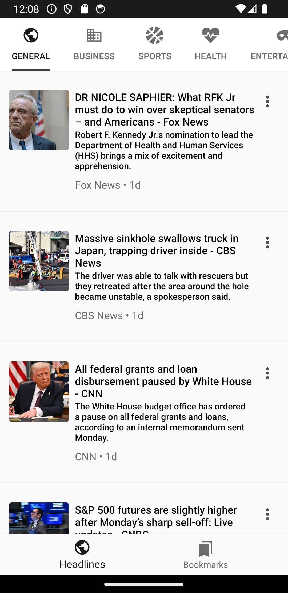
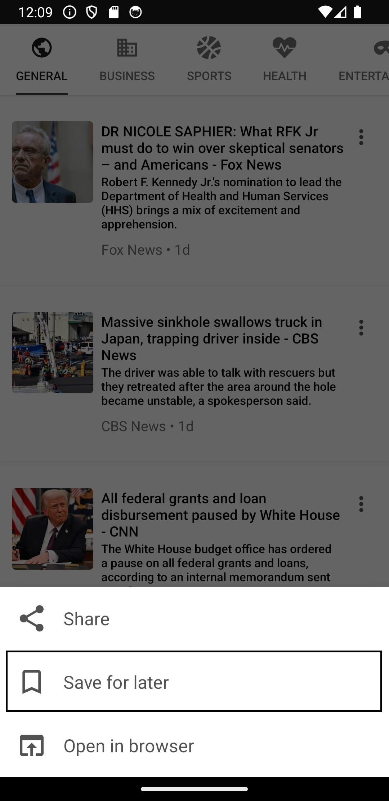
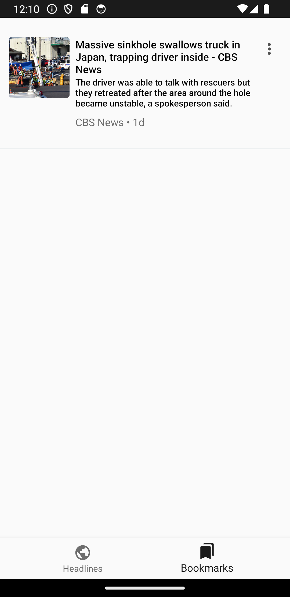
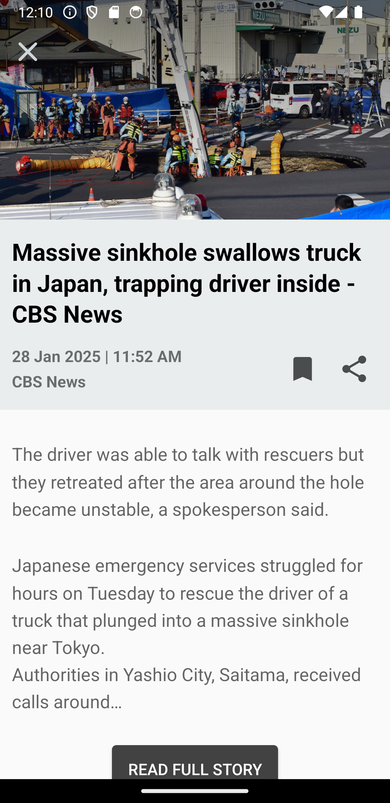

# NewsApp Assesment 
## for Internship at Markeble 
### by Muhammad Waqas Khan

A bit overview, it uses news API to get news and get JSON data back. Then it is parsed using google's gson library and the requests are sent by Retrofit.

#### Got NewAPI Key from https://newsapi.org

##### Home

#### To bookmark

 ##### Show Bookmarks

 ##### Full Story

##### video
<video src="newsappsave.mp4" width="40%"/>

#### Libraries
- [Google gson](https://github.com/google/gson) For parsing JSON data
- [Retrofit](http://square.github.io/retrofit/) For sending network requests
- [Glide](https://github.com/bumptech/glide) Loading and caching images
- [Room, LiveData and ViewModel](https://developer.android.com/topic/libraries/architecture/) Latest Android Architecture components
- [Databinding](https://developer.android.com/topic/libraries/data-binding/) Binding data and reducing 100s of Lines of Code

